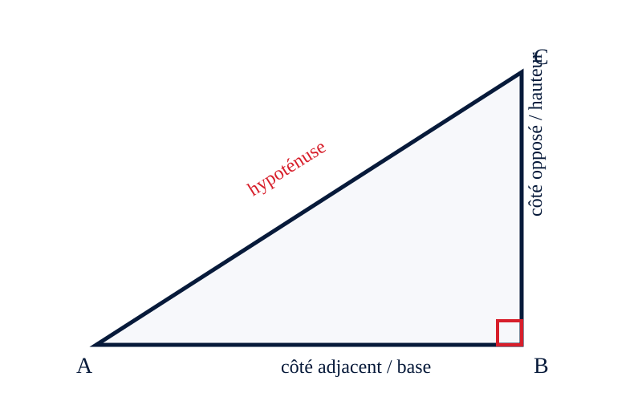

# 3e — Séance 3 : Construire et justifier
## SUPPORTS M

> **Nexus Réussite - Stage de pré-rentrée 2026-2027**

## Règles d’utilisation

- Imprimer en A4, éventuellement sur papier épais.
- Découper les cartes avant la séance.
- Ne distribuer l’aide qu’après une première tentative.
- Conserver la production initiale de l’élève pour la comparer à la reprise.

### Activité 2 — Les carrés de Pythagore

Construire sur les côtés d’un triangle (6)-(8)-(10) trois carrés.

Consigne :

> Compare les aires des trois carrés.
> Quelle relation observes-tu ?
> Pourquoi (6+8) n’est-il pas la relation pertinente ?

## Figures imprimables

## Cartes à découper

| Carte | Texte à imprimer |
|---|---|
| PROPRIÉTÉ | Quelle propriété ou relation relie les données à ce que tu cherches ? |
| REPRÉSENTATION | Fais un schéma, un tableau, une droite ou un graphique avant de calculer. |
| CONTRÔLE | Ton résultat a-t-il le bon signe, la bonne unité et le bon ordre de grandeur ? |
| CONFIANCE | Je devine / j’hésite / je pense avoir juste / je peux expliquer. |

_Source pédagogique unique : `stage_prerentree_troisieme_maths.md`. Les objectifs, l’ordre des séances et les diagnostics ne sont pas modifiés ; ils sont déclinés ici en supports opérationnels._
