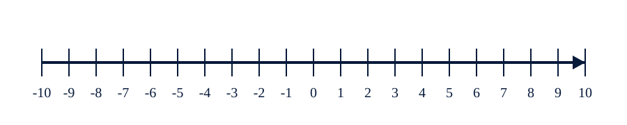
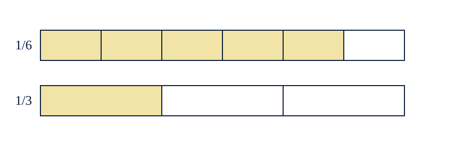

# 4e_S1_SUPPORTS_Manipulation
## Séance 1 — Calculer avec du sens

> **Nexus Réussite - Stage de pré-rentrée 2026-2027**

## Règles d’utilisation

- Imprimer en A4, éventuellement sur papier épais.
- Découper les cartes avant la séance.
- Ne distribuer l’aide qu’après une première tentative.
- Conserver la production initiale de l’élève pour la comparer à la reprise.

### Activité « Le thermomètre contradictoire »

Objectif : distinguer déplacement et signe.

Consigne :

> La température est de $-4^\circ$C. Elle augmente de $6^\circ$C.
> Place les deux températures sur la droite et écris le calcul.
### Activité « Deux bandes, une différence »

Objectif : rendre visibles les fractions équivalentes.

Consigne :

> Colorie (5/6) d’une bande.
> Colorie (1/3) d’une autre bande de même longueur.
> Réécris (1/3) en sixièmes et détermine la différence.

## Figures imprimables

## Cartes à découper

| Carte | Texte à imprimer |
|---|---|
| PROPRIÉTÉ | Quelle propriété ou relation relie les données à ce que tu cherches ? |
| REPRÉSENTATION | Fais un schéma, un tableau, une droite ou un graphique avant de calculer. |
| CONTRÔLE | Ton résultat a-t-il le bon signe, la bonne unité et le bon ordre de grandeur ? |
| CONFIANCE | Je devine / j’hésite / je pense avoir juste / je peux expliquer. |

_Source pédagogique unique : `stage_prerentree_quatrieme_maths.md`. Les objectifs, l’ordre des séances et les diagnostics ne sont pas modifiés ; ils sont déclinés ici en supports opérationnels._
